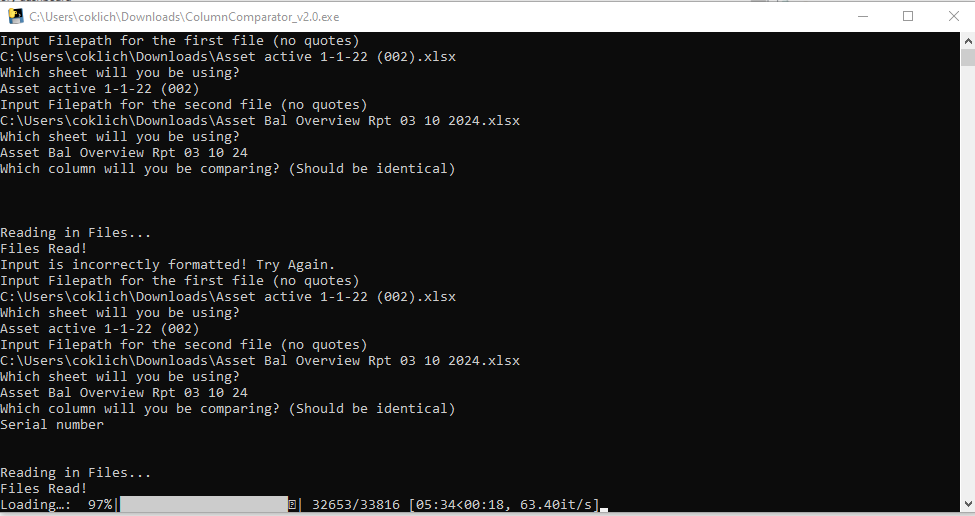

# Excel Column Comparator

A high-performance fuzzy matching tool that solves a common data reconciliation challenge: matching similar but non-identical text entries across Excel spreadsheets.

## The Problem

Data matching across spreadsheets is often complicated by:
- Inconsistent formatting
- Typos and data entry errors
- Different naming conventions
- Manual matching taking hours of work (6+ hours/month in our case)

Excel's built-in fuzzy matching has limitations that make it unsuitable for large datasets or complex matching needs.

## The Solution

This tool provides:
- Intelligent fuzzy matching using multiple string similarity algorithms
- Customizable matching thresholds
- High-performance processing (reduced 6-hour task to 5 minutes)
- User-friendly interface for non-technical users
- Complete data visibility (matched and unmatched records)

## How It Works

1. **Input**: Select two Excel files and specify the columns to compare
2. **Processing**: 
   - Applies multiple string similarity algorithms (Levenshtein, Jaro-Winkler, etc.)
   - Uses weighted scoring for optimal matches
   - Processes in optimized batches for performance
3. **Output**:
   - Creates a new Excel file with matched pairs
   - Includes similarity scores for validation
   - Lists unmatched records with original data
   - Preserves selected columns from both source files

## Technical Features

- **Performance**: 300% faster than previous versions
- **Accuracy**: Custom-tuned algorithm for business context
- **Usability**: Compiled as Windows executable (.exe)
- **Flexibility**: Configurable column selection and output

## Technologies Used

- **Pandas**: Data manipulation and Excel I/O
- **Jellyfish**: String similarity algorithms
- **Difflib**: Additional text comparison
- **Tqdm**: Progress visualization
- **Beaupy**: User interface elements
- **Pyinstaller**: Executable creation

## Version History

- **V1-3**: Initial implementations, reduced processing time to 1 hour
- **V4**: Added column selection functionality
- **V6**: Implemented unmatched records export
- **V7**: Performance optimization (current version)
  - 300% speed improvement
  - Complete data visibility with merged results